# Lets do stegggggggggggggggggg
I gotta finished some challenges in 1 week.
1 week?
That is 1 weekkkkkkkkkkk???????????
## Steganomobile
We got a challenge file, which contain a sequence of numbers.
```cmd
[an2in@an2in Steganomobile]$ ls
ch6.txt
[an2in@an2in Steganomobile]$ cat *
222-33-555-555-7-44-666-66-33
```
This sequence feels so familiar—just like the number layout on those classic Nokia phones back in the day:)).

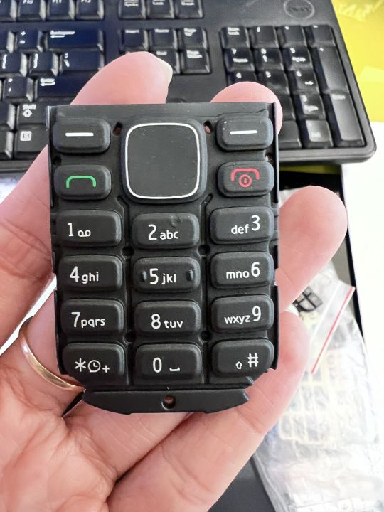

We got our answer
```cmd
222 -> c
33 -> e
555 -> l
555 -> l
7 -> p
44 -> h
666 -> o
66 -> n
33 -> e
```
And ```cellphone``` is the password for this challenge.
## TXT - George and Alfred
### Description
This challenge is only available in French.
### Solve
Hmmmmm, only available in French? Check it first.
```cmd
[an2in@an2in TXT - George and Alfred]$ ls
ch4.txt
[an2in@an2in TXT - George and Alfred]$ cat *
Je suis très émue de vous dire que j'ai
bien compris, l'autre jour, que vous avez
toujours une envie folle de me faire
danser. Je garde un souvenir de votre
baiser et je voudrais que ce soit
là une preuve que je puisse être aimée
par vous. Je suis prête à vous montrer mon
Affection toute désintéressée et sans cal-
cul. Si vous voulez me voir ainsi
dévoiler, sans aucun artifice mon âme
toute nue, daignez donc me faire une visite
Et nous causerons en amis et en chemin.
Je vous prouverai que je suis la femme
sincère capable de vous offrir l'affection
la plus profonde et la plus étroite
Amitié, en un mot, la meilleure amie
que vous puissiez rêver. Puisque votre
âme est libre, alors que l'abandon où je
vis est bien long, bien dur et bien souvent
pénible, ami très cher, j'ai le coeur
gros, accourez vite et venez me le
fait oublier. À l'amour, je veux me sou-
mettre. 

Alfred de Musset a répondu ceci :

Quand je vous jure, hélàs, un éternel hommage
Voulez-vous qu'un instant je change de language
Que ne puis-je, avec vous, goûter le vrai bonheur
Je vous aime, ô ma belle, et ma plume en délire
Couche sur le papier ce que je n'ose dire
Avec soin, de mes vers, lisez le premier mot
Vous saurez quel remède apporter à mes maux.


De la même manière George Sand a répondu ceci :

Cette grande faveur que votre ardeur réclame
Nuit peut-être à l'honneur mais répond à ma flamme.

Utilisez la dernière "phrase cachée", pour valider cette épreuve.
```
Nah, this looks like a OSINT challenge to me. After some googling efforts, I know that this is piece of information is is a brilliant example of 19th-century flirtation through acrostics—clever, poetic, and a little scandalous.
Throw it to Google Translate, we knew the meaning of this literary exchange.
```cmd
I am deeply moved to tell you that I understood perfectly the other day that you still have a burning desire to dance with me. I cherish the memory of your kiss, and I would like it to be proof that I can be loved by you. I am ready to show you my completely selfless and uncalculating affection. If you wish to see me thus, revealing my soul completely naked, without any artifice, please pay me a visit. And we will talk as friends along the way. I will prove to you that I am the sincere woman capable of offering you the deepest and closest affection, friendship—in short, the best friend you could ever dream of. Since your soul is free, while the abandonment in which I live is so long, so hard, and so often painful, my dearest friend, my heart is heavy. Come quickly and help me forget it. To love, I want to submit.

Alfred de Musset replied:

When I swear to you, alas, eternal homage,
Would you have me change my language for a moment?
Why can't I, with you, taste true happiness?
I love you, oh my beautiful one, and my pen, in a frenzy,
Lays down on paper what I dare not say.
Carefully, read the first word of my verses.
You will know what remedy to bring to my woes.

Similarly, George Sand replied:

This great favor that your ardor demands
Perhaps harms honor, but answers my flame.

Use the last "hidden sentence" to validate this test.
```
Let's craft the first word of each sentence to get our message.
"**Quand voulez-vous coucher avec moi**" → "When do you want to sleep with me?"
"**Cette Nuit**" → "Tonight."

We got our password.
```cmd
Cette Nuit
```
## Twitter Secret Messages
### Description
We suspect that this tweet hides a rendezvous point. Help us to find it.

```h ose  a  jο  yоu  lον ,  and  you   і l   e     have  tο    rk  a  day  in  yοur  lіf```

The validation password is the meeting place (in lower case).
### Solve
**rendezvous**: an arrangement to meet someone, especially secretly, at a particular place and time, or the place itself.

Hmmmm, at first glance, I thought my work would have to figure out the original quote and craft the missing words to get the place.
But after doing that, I got gibberish: ```Cobewlnverwoe```.
I tried OSINT by serching the phrase *Twitter Secret Messages*, and I found this one website https://wulfsige.com/crypto/, which allow me to hide secret messages in my tweets (or any text) with steg-of-the-dump.js.
Noice, now just decode it.

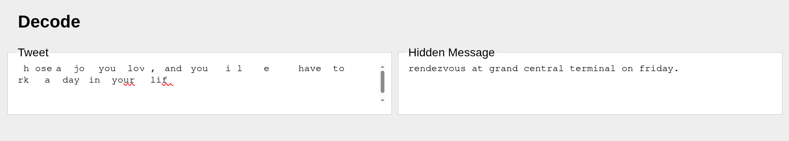

We got our password.
```cmd
grand central terminal
```
## Dot and next line
### Description
“Rien de trop est un point dont on parle sans cesse et qu’on n’observe point.”

Jean de La Fontaine!


### Solve
Translate the quote:
“Nothing in excess is a point that is constantly talked about but never observed.”

From the statement and the name of the problem, we know that this problem is realted the place the dot is and its adjacent line.

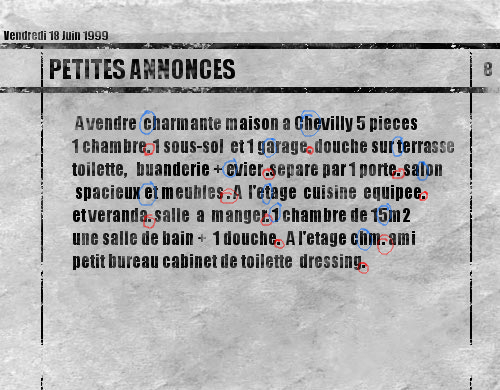

We got our password
```chatelet15h```
## EXIF - Metadata
### Description
Our sad friend pepo got lost! Can you find where he is ?
The password is the city where pepo is located.
### Solve
We got a file. As the name the challenge suggest, we need to check the metadata to get the location embedded in the image.
```
[datle@dat EXIF - Meatadate]$ ls
ch1.png
[datle@dat EXIF - Meatadate]$ exiftool *
ExifTool Version Number         : 13.36
File Name                       : ch1.png
[...]
GPS Latitude                    : 43 deg 17' 56.27" N
GPS Longitude                   : 5 deg 22' 49.38" E
GPS Position                    : 43 deg 17' 56.27" N, 5 deg 22' 49.38" E
```
Throw it to Google Map, and we got the answer, that is 
```Marseille```
## WAV - Noise analysis

We are given a ```.wav``` file, which sounds weird. I threw it to Audacity, slow it down and reverse it. Using my stupid Listening skills, I heard the password.
```3b27641fc5h0```

## EXIF - Thumbnail
### Description
Find the password hidden in this image in JPG format.
### Solve
We are given an image.


Looking at the title of the challenge, I quickly checked the metadata of the image.
```
[an2in@an2in EXIF - Thumbnail]$ exiftool ch10.jpg
ExifTool Version Number         : 13.36
[...]
Megapixels                      : 0.974
Thumbnail Image                 : (Binary data 41506 bytes, use -b option to extract)
```
It seems that are nothing really special here.
I then googling the phrase **EXIF - Thumbnail** for more information. And I found this website: https://www.dcode.fr/exif-thumbnail

I know that **EXIF Thumbnail** metadata is information embedded in image files, usually in JPEG format, that contains a thumbnail version of the image. It is stored in EXIF (Exchangeable image file format) data and allows you to quickly preview the image without needing to load the entire file.

And the website even offer tools to extract the thumbnail of an image. I uploaded the file, and this is what I received.

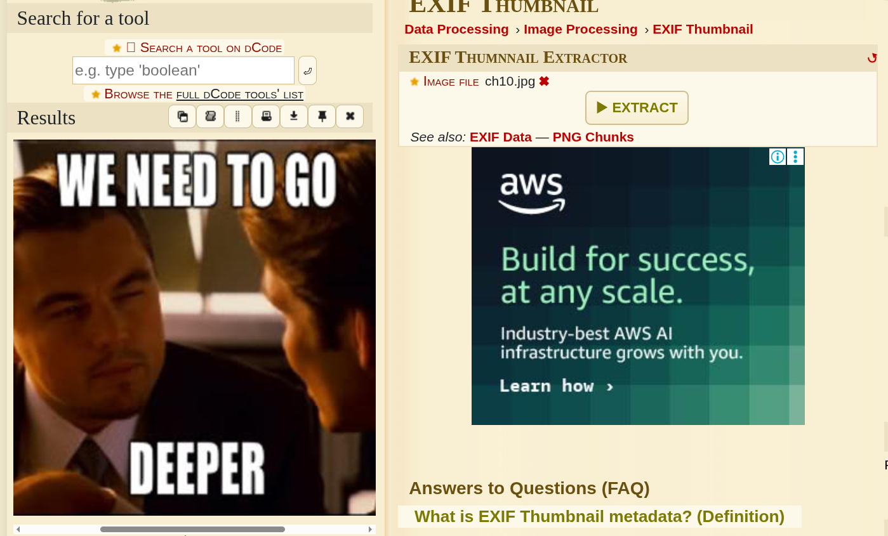

A replica of the original image, or is it?

I checked the extracted image.
```
[an2in@an2in EXIF - Thumbnail]$ exiftool thb.png
ExifTool Version Number         : 13.36
File Name                       : thb.png
[...]
Thumbnail Image                 : (Binary data 15957 bytes, use -b option to extract)
[an2in@an2in EXIF - Thumbnail]$ strings thb.png
JFIF
Exif
JFIF
We need to go deeper
[...]
```
Hmmm, there is really nothing special here except the phrase told me to go **deeper** again. I threw to the decoding page one more time.


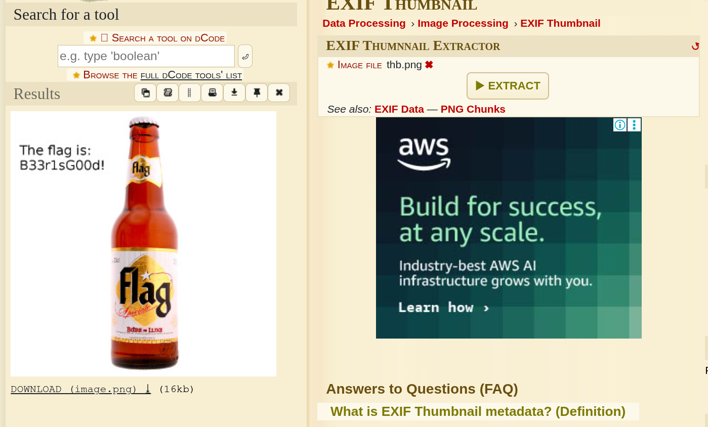

Voila, we got our password:
```
B33r1sG00d!
```
## WAV - Spectral analysis
### Description
Interesting mix.
### Solve
We are given an audio file which sounds really weird. I threw the file to Audacity and use Spectro view.

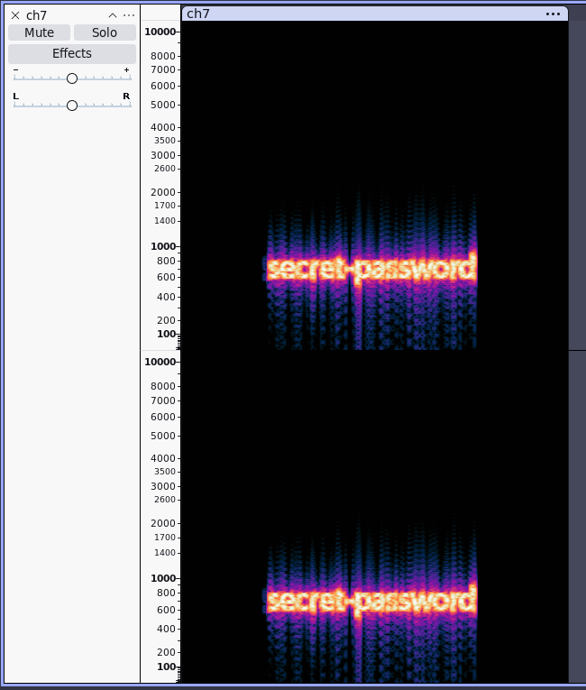

We got our password.
```
secret-password
```
## Crypt - art
### Description
A police unit intercepted a message from a terrorist group. This message may contain a secret key used to encrypt other communications. They need you to decrypt it !
### Solve
We are given a ```.ppm``` file.
I googled some stuff and found these interesting informations.

The .ppm (Portable Pixel Map) format is a primitive, uncompressed image file that stores pixel data as human-readable text numbers (RGB values), making it the ideal medium for Piet, an esoteric programming language where source code appears as abstract, multi-colored geometric art. Because Piet executes commands—such as arithmetic or stack manipulation—based on the precise mathematical difference in hue and lightness between adjacent color blocks, it requires the absolute pixel accuracy that compressed formats like JPEG destroy with visual "noise." The .ppm format serves as a critical bridge by guaranteeing this lossless color precision and uniquely allowing programmers to "write" these visual programs using standard text editors simply by typing out the color numbers.

With that information, I knew that this challenge file contains some hidden messages. I used an online Piet interpreter to grasp it.

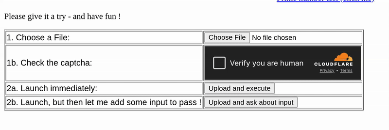

We got our key ```EYJFRGTT```.

We need to find the encrypted message to decrypt with this key.

```
[an2in@an2in Crypt-art]$ strings ch8.ppm
70 50
  Hi! Welcome to  
esoteric programming!
The encrypted pass is:  
EPCQFBXKWURQCTXOIPMNV
 Bienvenue a la program
mation esoterique!
Le pass encrypte est
EPCQFBXKWURQCTXOIPMNV
```

We got our message ```EPCQFBXKWURQCTXOIPMNV```.
Let's decrypt it.

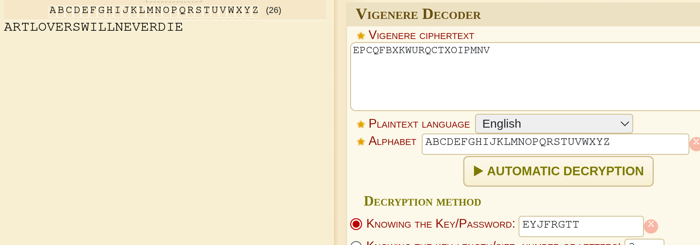

## Yellow dots
### Description
You attend an interview for a forensic investigator job and they give you a challenge to solve as quickly as possible (having the Internet).
They ask you to find the date of printing as well as the serial number of the printer in this document.
You remain dubitative and accept the challenge.

The answer is in the form:

hh:mm dd/mm/yyyy SSSSSSSS

with

hh: the hour of the event

mm: the minutes of the event

dd: the day of the event

MM: the month of the event

yyyy: the year of the event

SSSSSSSS: the serial number
### Solve
We are given an image file.


At first glance, I thought it it just a normal image that contain some Metadata in it. But nahhh, after checking the metadata, I got nothing at all.
Then I tried the most straight-forward way I could think of - Check the image for anomalies.

Luckily, I found something suspicious.

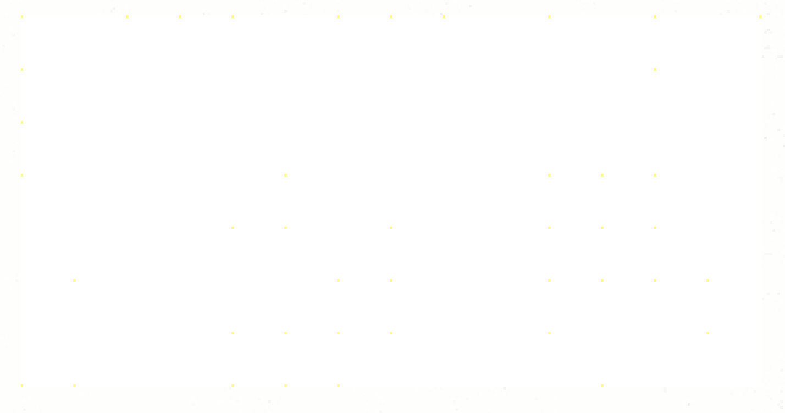

Some "yellow dots", yeah, seriously, yellow dots in the image. I tried OSINT by googling "Yellow dots", and I found this wiki site: https://en.wikipedia.org/wiki/Printer_tracking_dots

This site said that those yellow dots I found is a digital watermark which many color laser printers and photocopiers produce on every printed page that identifies the specific device that was used to print the document.

Ok, that is some new piece of knowledge to me. I then found a website allowed me to decode those not-so-weird dots.


We got our password
```
11:05 27/07/2014 06922930
```

## Poem from Space
### Description
Deeply understand the meaning of this famous poem to validate this challenge.
### Solve
We are given a ```.txt``` file. I opened it up, and accidentally pressed ```Ctrl + A```. 
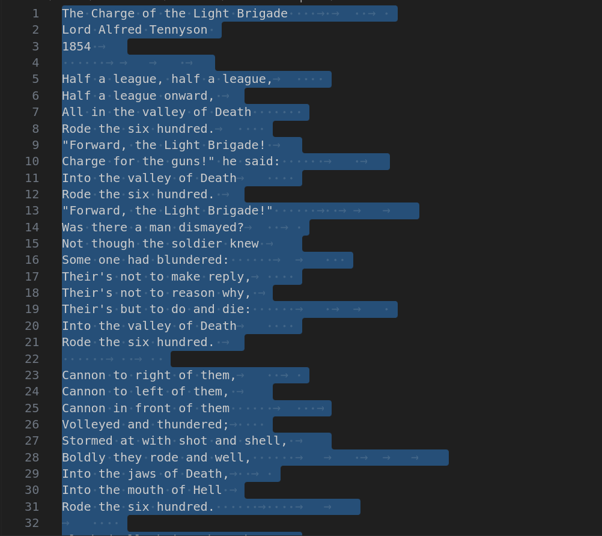

Ohh, there is something mysterious here. After some OSINT efforts, I found that this is **whitespace encoding**. I removed all the visible text and throw it to an decoder.

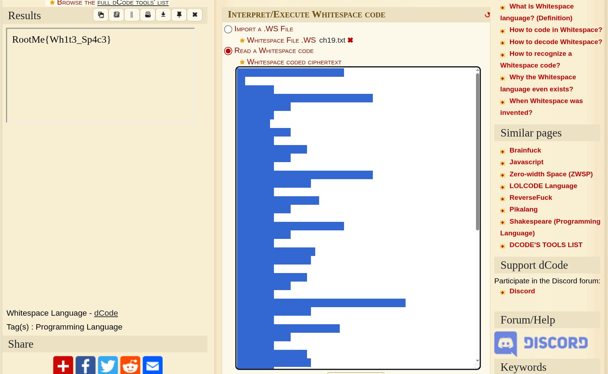

## PDF - Embedded
### Description
Find the hidden information in this PDF file.
### Solve
We are given a pdf file written entirely in French.

As the title suggests, I threw the entire file to PDFStreamDumper.

I found some suspicious file hidden in the pdf itself.

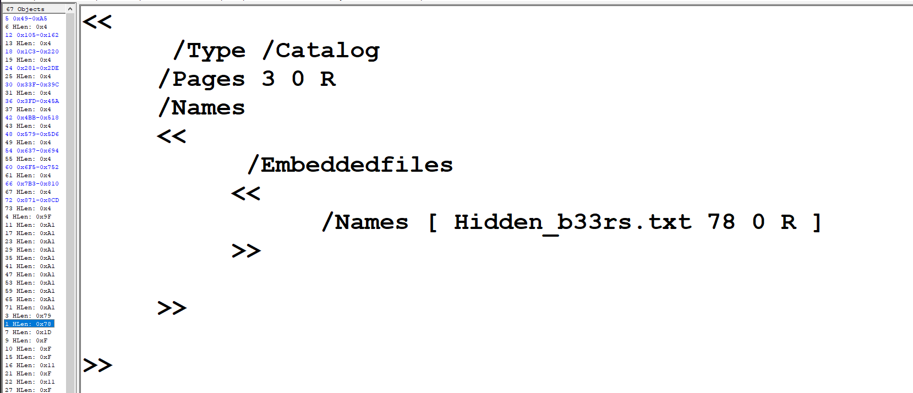

I follow the data by going to stream 78

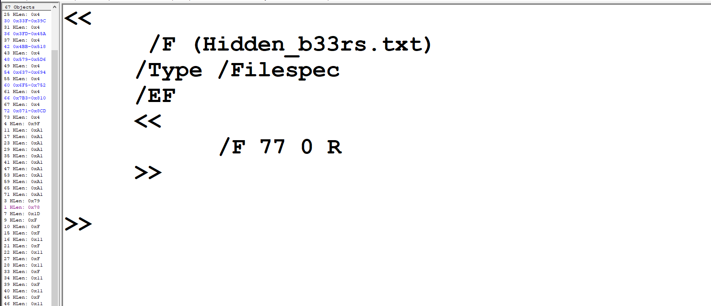

Back to stream 77

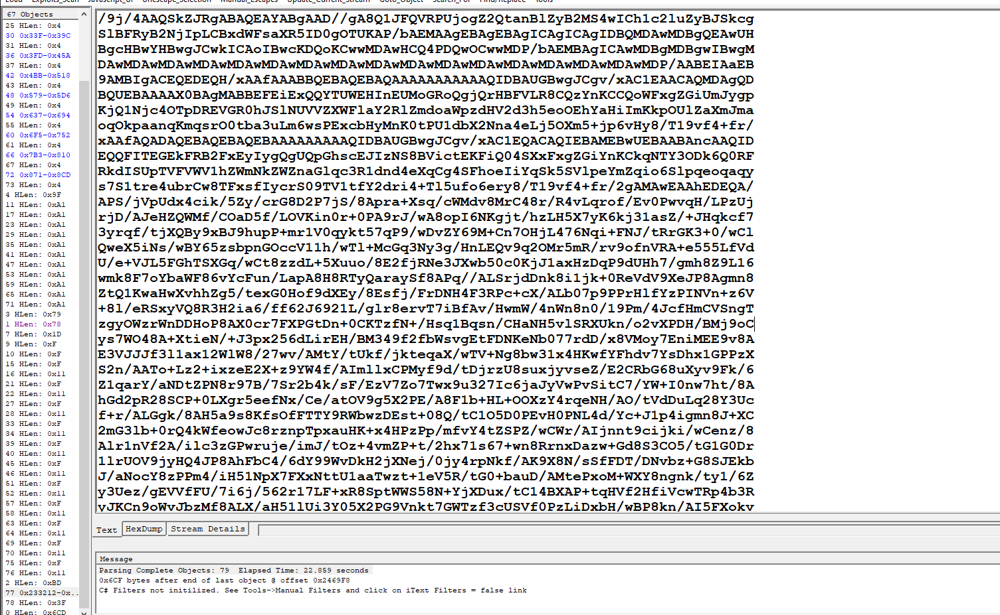

Ahh, some base64 encoded strings. I threw it to CyberChef.

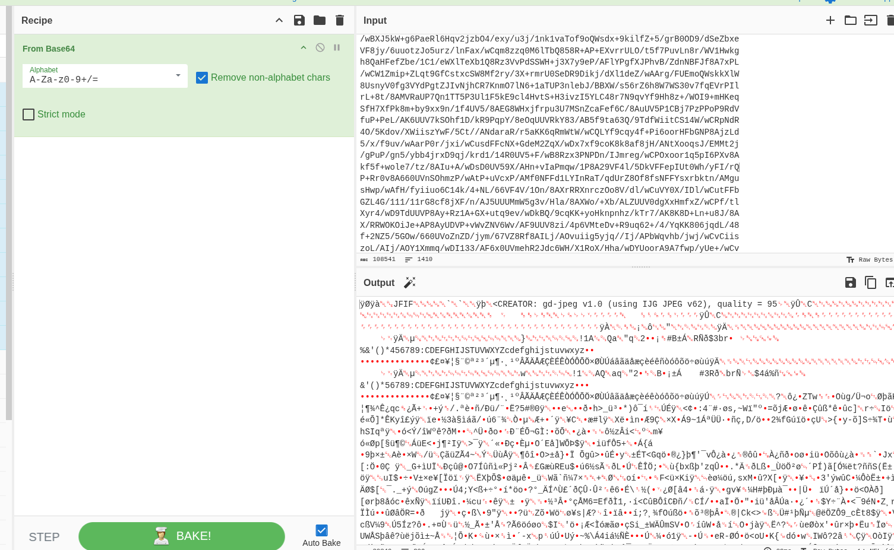

Oh, an image file. I decoded the strings to get the image.

```cmd
base64 -d [the string, it is so looooooooong] > img.jpeg
```

We got our password.
 ```cmd
Hidden_embedded_Fil3
 ```


## Spotiyf
### Description
Mr.Pirin told me to solve

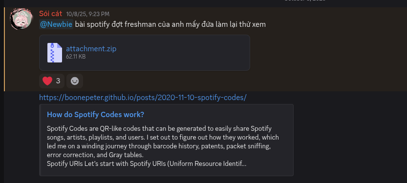

### Solve
We are given some Spotify Codes.
Mr.Pirin guided me to read this links:
https://boonepeter.github.io/posts/spotify-codes-part-2/

It simply about the encoding and the decoding process of the Spotify Codes. The step are kinda complex that it takes me more than 2 days to not fully understand it. Luckily, the author of this post has written some decoding scripts to grasp the information hidden in the Spotify Codes the challenge gave us (which I believe has been modified, cause I cannot scan it with the Spotify mobile app).

GitHub repository: https://github.com/boonepeter/boonepeter.github.io-code.git

I cloned it and ran the code locally.

```cmd
(myenv) [an2in@an2in src]$ python3 decode_barcode.py --token=unused Music_0.jpg
Heights: [0, 6, 0, 5, 3, 6, 7, 2, 1, 4, 5, 7, 7, 4, 4, 1, 4, 4, 7, 4, 7, 2, 0]
Error in levels; Use real decoder!!!
Media ref: -1
[...]
```

The decoder wants us to provide an authorized token to run the decoding process, yet it is impossible. So I decided to ask my friend - a Reverse Enginnering player to help me modify the code to bypass the token step.

He instructed me to fix these following lines:
```python
# In src/encode_decode.py

def spotify_bar_decode(levels):
    level_bits = np.array([gray_code_inv[levels[i]] for i in range(20)], dtype=bool).flatten()
    conv_bits = [level_bits[43*i % 60] for i in range(60)]
    cols = [i for i in range(60) if i % 4 != 2] # columns to invert
    conv_bits45 = np.array([conv_bits[c] for c in cols], dtype=bool)
    bin45 = (1*np.dot(conv_bits45, conv_generator_inv) % 2).tolist()
    
    # --- MODIFIED START ---
    # Convert the list of bits to a string
    raw_bin_str = "".join(str(int(b)) for b in bin45)
    print("Raw Binary")
    print(f"Binary String (45 bits): {raw_bin_str}")
    import sys
    sys.exit()
    # --- MODIFIED END ---
```
Now I tried to run the code again.
```cmd
(venv) [an2in@an2in src]$ python decode_barcode.py --token=no Music_0.jpg
Heights: [0, 6, 0, 5, 3, 6, 7, 2, 1, 4, 5, 7, 7, 4, 4, 1, 4, 4, 7, 4, 7, 2, 0]

Raw Binary
Binary String (45 bits): 001011101101111010001100111010100000001000100
```
I repeated the process the others five images. 
And these are all the Binary String I got after all:
```cmd
001011101101111010001100111010100000001000100
111110100010111000101100000101100000010110111
001001101111011000001100111001100000011011011
000011000000111011001010111110100000000110010
100111100110011010010010001011100000010001110
101111101000010010000100100001000000000100001
```
I decoded the resulted strings based on this logic flow:

- Take the first 32 bits of each binary string (ignoring the checksum at the end).

- Split them into 4 bytes (8 bits each).

- Convert each byte to ASCII.

- Reverse the order of the 4 characters found in each file.

First binary string:

Raw: 00101110 11011110 10001100 11101010

Decoding:

00101110 $\rightarrow$ t

11011110 $\rightarrow$ {

10001100 $\rightarrow$ 1

11101010 $\rightarrow$ W

Characters: t { 1 W

Reversed: W1{t

Repeat this process, and concatenate all of them.

We got our flag
```
W1{th4t_g0od_Sp0tIfy!!!}
```